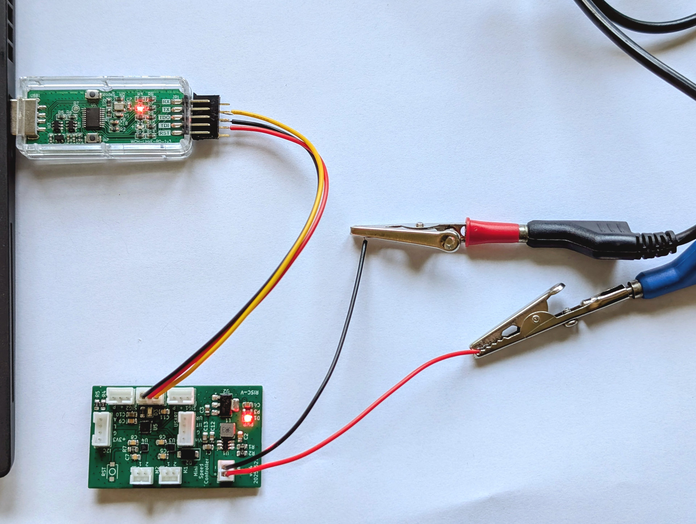
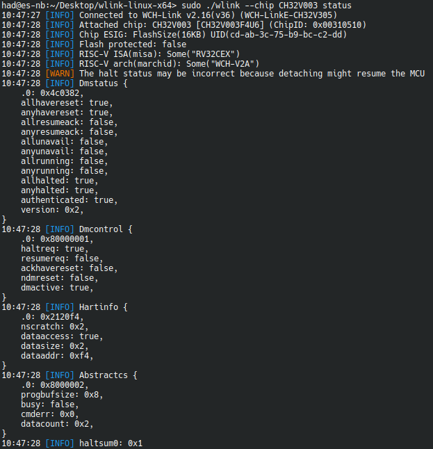

# Hardware verification v0.4

List:
 - ✅ DCDC
 - ✅ LDO
 - ✅ CH32V003
 - ✅ DRV8837GSGR
 

## First Power-Up test of CH32V003

## Motor Spinning

See [this video](picture/motor_spinning_no_meta.mp4).

Roughly 1.4A@12V was consumed in this rather extreme movement test.

## Connect test using wlink

