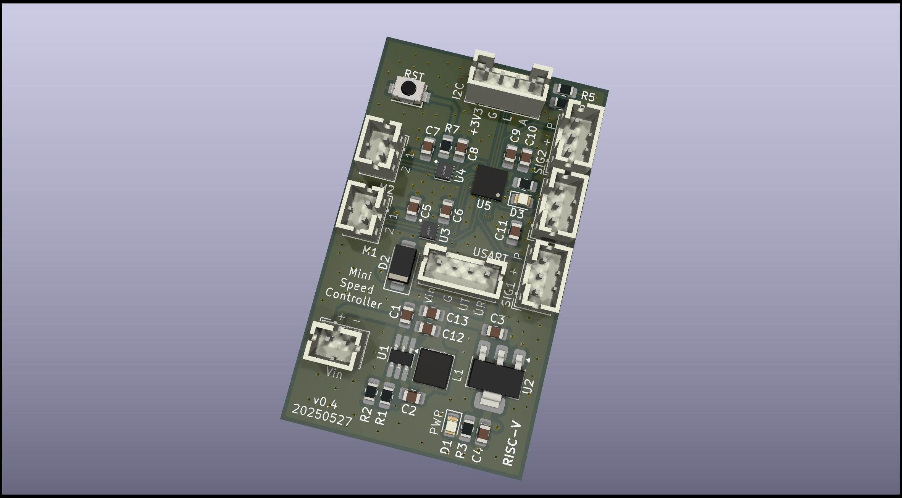

# RISC-V DC-Motor Speed Controller

This project implements a compact DC motor speed controller using a RISC-V microcontroller. It is designed for precision control via PWM feedback and communicates through a serial interface. Additional  sensors can be attached using I2C.

Beware that the entire PCB isn't a masterpiece as this is just for technology evaluation. 

## Why this thing?

Mostly for playing around with very cheap RISC-V microcontrollers and an execise for C/Rust with very limited resources.

It can be used for controlling simple toy robot chassis that usually have two DC motors with light barriers.

## Features

- **WCH CH32V003**: 48 MHz RISC-V microcontroller with 16 KB Flash, 2 KB SRAM  
- **Texas Instruments DRV8837GSGR**: Low-voltage brushed DC motor driver, up to 1.8 A continuous current  
- **Diodes Inc. AP62300TWU**: 3 A step-down (buck) converter  
- **Advanced Monolithic Systems AMS1117-3.3**: LDO regulator providing 3.3 V from a 7 V input  
- **Optical encoders**: Provide motor speed feedback via PWM signals  
- **Exposed Communication interfaces**:  
  - **USART**: Command input  
  - **I²C**: External sensor connectivity  

## Pin Configuration

| Pin | Meaning          |
|-----|------------------|
| PC0 | pwm_speed_input1 |
| PC1 | I2C, SDA         |
| PC2 | I2C, SCL         |
| PC3 | motcon2_sleep    |
| PC4 | motcon2_in2      |
| PC5 | motcon1_sleep    |
| PC6 | motcon1_in2      |
| PC7 | X                |
| PD0 | X                |
| PD1 | SWDIO            |
| PD2 | motcon1_pwm_in1  |
| PD3 | pwm_speed_input2 |
| PD4 | X                |
| PD5 | usart_tx         |
| PD6 | usart_rx         |
| PD7 | nRST             |
| PA1 | motcon2_pwm_in1  |
| PA2 | STATUS_LED       |

# Verification

[Hardware Verification v0.4](EVALUATION-v0.4.md)

# License

GPLv3
