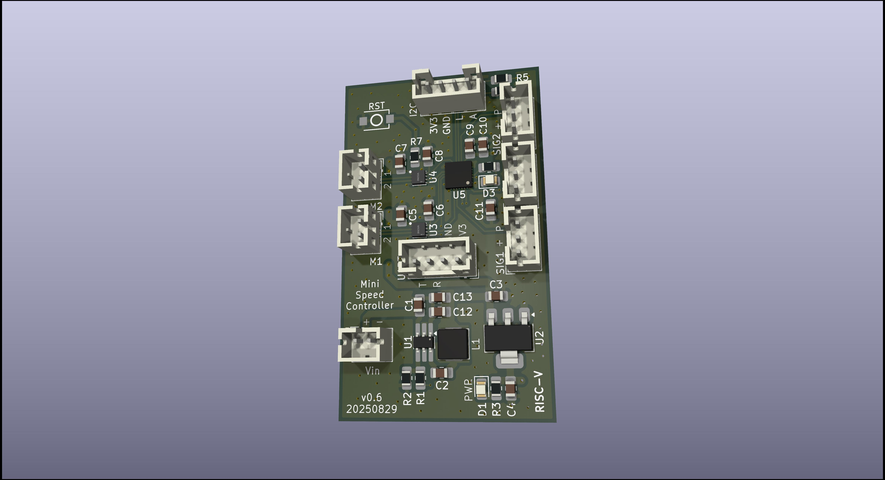
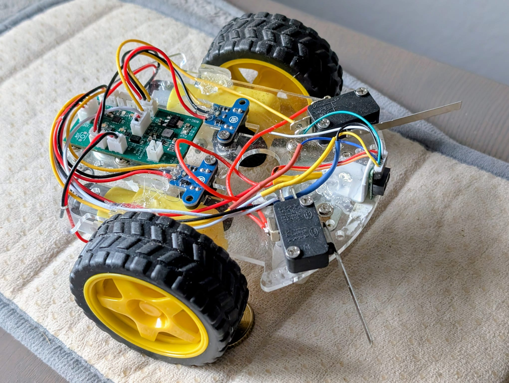

# Mini (RISC-V DC-Motor) Speed Controller

This project implements a compact DC motor speed controller using a RISC-V microcontroller. 

It is designed for speed control via pulse feedback from a light barrier and communicates through a serial interface. Additional  sensors can be attached using I2C.

Beware that the entire PCB isn't a masterpiece as this is just for technology evaluation. 

## Why this thing?

Mostly for playing around with very cheap RISC-V microcontrollers and an execise for C/Rust with very limited resources. It can be used for controlling simple toy robot chassis that usually have two DC motors with light barriers which can be used as feedback loop for a speed control algorithm.

## System Overview

#### Power Supply
  - AP62300 (3A Buck Converter) → 7V rail (for DC motors)  
  - AMS1117-3.3 (LDO Regulator) → 3.3V rail (for microcontroller and motor driver logic)  

#### WCH CH32V003 Microcontroller 
  - 48 MHz RISC-V core  
  - 16 KB Flash / 2 KB SRAM  
  - Powered from 3.3V rail
    
#### Texas Instruments DRV8837GSGR 
  - Brushed DC motor driver  
  - 1.8A continuous current capability  
  - Logic powered from 3.3V rail
  - DC motors powered from 7V rail

### Pin Configuration

#### Motor Controller 1
| Pin | Meaning          |
|-----|------------------|
| PC5 | motcon1_sleep    |
| PC6 | motcon1_in2      |
| PD2 | motcon1_pwm_in1  |

#### Motor Controller 2
| Pin | Meaning          |
|-----|------------------|
| PC3 | motcon2_sleep    |
| PC4 | motcon2_in2      |
| PA1 | motcon2_pwm_in1  |

#### PWM Speed Inputs
| Pin | Meaning          |
|-----|------------------|
| PC0 | pwm_speed_input1 |
| PD3 | pwm_speed_input2 |

#### Communication Interfaces
| Pin | Meaning          |
|-----|------------------|
| PC1 | i2c_sda          |
| PC2 | i2c_scl          |
| PD5 | usart_tx         |
| PD6 | usart_rx         |

#### Debug & Reset
| Pin | Meaning          |
|-----|------------------|
| PD1 | SWDIO            |
| PD7 | nRST             |

#### Indicators
| Pin | Meaning          |
|-----|------------------|
| PA2 | status_led       |

### Unused / Spare
| Pin | Meaning          |
|-----|------------------|
| PC7 | X                |
| PD0 | X                |
| PD4 | X                |

# Verification

[Hardware Verification v0.4](EVALUATION-v0.4.md)

# License

CERN OHL v2 – Strongly Reciprocal (S)
